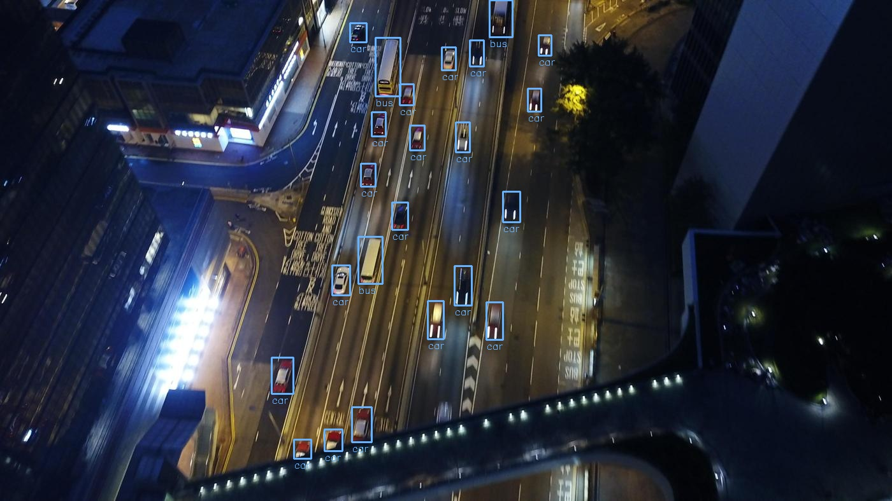
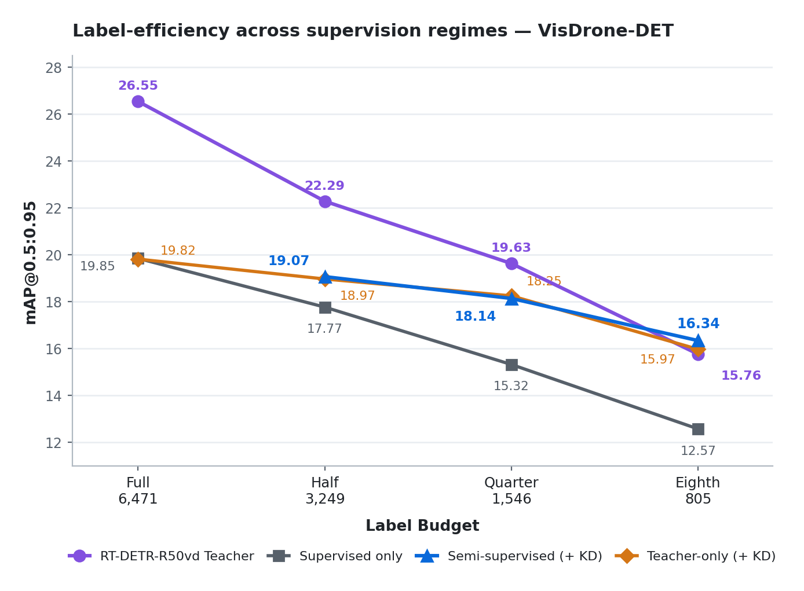
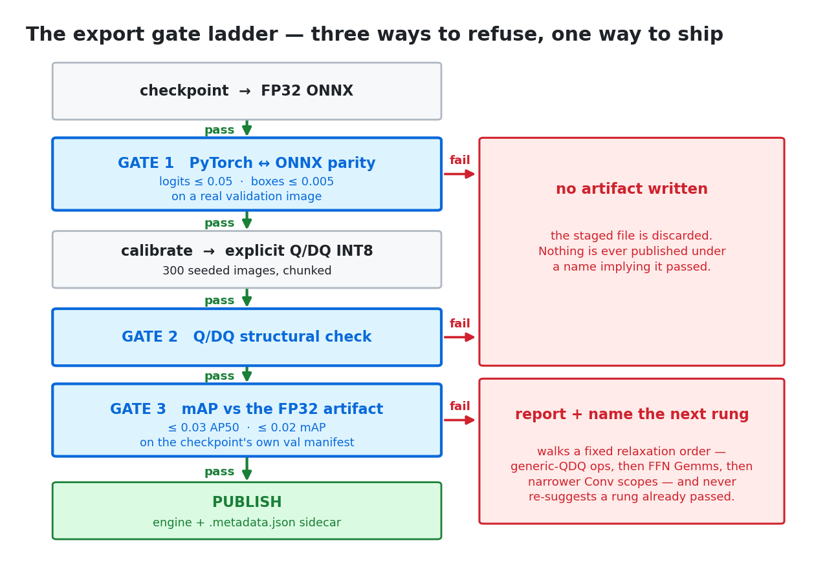

<h1 align="center">Edge Object Detection</h1>
<p align="center">
  <b>Distilling a transformer's accuracy into a deployable CNN — on a fraction of the labels, robust to
  conditions under-represented in the source data, carried through an accuracy-gated INT8 export to
  TensorRT.</b><br>
  RT-DETR-R50vd → YOLO26n on VisDrone-DET.
</p>

<p align="center">
  
  
  
  
  
</p>

<p align="center">
  
</p>
<p align="center">
  <sub><b>Detections from the YOLO26n student trained on one-eighth of the VisDrone annotations.</b></sub>
</p>

<table align="center">
<tr>
<th>Teacher</th>
<th>Student</th>
<th>Compression</th>
<th>Data</th>
</tr>
<tr>
<td>RT-DETR-R50vd @ 736×1280<br>42.75 M params / 155.2 GMACs</td>
<td>YOLO26n @ 736×1280<br>2.51 M params / 6.81 GMACs</td>
<td>17.0× params<br>22.8× MACs</td>
<td>VisDrone-DET, 10 classes<br>6,471 / 548 / 1,610 images</td>
</tr>
</table>

### Contents

1. [Overview](#1-overview) · 2. [Label-efficient domain adaptation](#2-label-efficient-domain-adaptation) · 3. [Cross-architecture knowledge distillation](#3-cross-architecture-knowledge-distillation)
4. [Robustness to deployment conditions](#4-robustness-to-deployment-conditions) · 5. [Post-training quantization and export to TensorRT](#5-post-training-quantization-and-export-to-tensorrt)
6. [How to run the code](#6-how-to-run-the-code) · 7. [Repository layout](#7-repository-layout) · [Appendix: Cross-architecture distillation learnings](#appendix-cross-architecture-distillation-learnings)

---

## 1. Overview

This repository works through one compound problem in applied object detection: how much of a
transformer's accuracy can be recovered by a model small enough to deploy, once the labelled-data
budget, the deployment environment, and export correctness are all held to a measured standard rather
than assumed. The setting is VisDrone-DET — dense, small aerial objects, captured mostly in clear weather —
but the methodology does not depend on that choice of dataset.

An RT-DETR-R50vd transformer (42.75 M parameters) is trained at a constrained label budget and used to
teach a YOLO26n CNN (2.51 M parameters, a 17× reduction) across the *entire* unlabelled image pool, not
only the images that were annotated. The student is trained under an augmentation policy that introduces
rain, low light, and motion blur, which the source dataset lacks or under-represents, without letting that augmentation
corrupt the distillation targets the teacher produces. The resulting checkpoint is carried through
post-training INT8 quantization and export to a strongly-typed TensorRT engine, gated on measured
accuracy rather than shipped on the assumption that quantization is safe.

At the tightest budget tested — 805 of 6,471 training images — the distilled student reaches **16.34
mAP@0.5:0.95**, ahead of a supervised model trained on twice as many labelled images (15.32), and ahead
of the transformer teacher that generated its own training signal (15.76). For scale, VisDrone is a
genuinely hard benchmark of small, dense aerial objects. An independently trained YOLO26n fine-tuned on
the complete labelled set for 300 epochs reports 14.64 mAP@0.5:0.95 on the same VisDrone test-dev set
used throughout this document
([dronefreak/visdrone-yolov26n](https://huggingface.co/dronefreak/visdrone-yolov26n)).

| Contribution | Approach | Headline result |
|---|---|---|
| Label-efficient adaptation | Semi-supervised training over the full unlabelled pool using teacher's pseudo labels | Quarter-budget student (**18.14** mAP@0.5:0.95) beats a *half*-budget supervised control (**17.77**) |
| Cross-architecture distillation | Decoupled soft logit KD and instance-normalized feature KD | Student trained on zero human boxes (pseudo-labels from the full-budget teacher) + distillation: **19.84 mAP@0.5:0.95**, matching direct human supervision (**19.85**) |
| Environmental robustness | Rain, night, blur-augmented view | Improves mAP@0.5:0.95 by 0.5–1.6 across adverse conditions |
| PTQ + TensorRT export | A strongly-typed TRT11 graph, a custom chunked MSE calibrator, layer-aware coverage scopes | INT8 costs ≤0.64 mAP@0.5:0.95 on both architectures; both clear the accuracy gate |

---

## 2. Label-efficient domain adaptation

To investigate how weak supervision and knowledge distillation assist aerial object detection when annotations are scarce, an RT-DETR-R50vd teacher model was trained on the VisDrone benchmark to serve as a high-capacity knowledge source. Using this teacher, training a compact YOLO26n student detector was conducted under four distinct training regimes across nested label budgets (full: 6,471 images, half: 3,249, quarter: 1,546, and eighth: 805): supervised training only, supervised training + KD, semi-supervised training (+ KD), and teacher-only supervision (+ KD). In the **semi-supervised (+ KD)** regime, YOLO26n is trained on all samples across the entire dataset, receiving ground-truth annotations for images within the budgeted subset while the teacher provides pseudo-labels and distillation signals for the unlabelled remainder. In **teacher-only (+ KD)**, YOLO26n sees all samples labelled exclusively by the teacher, utilizing zero human annotations during student training. Crucially, across all experiments the teacher followed the identical supervised label budget as the student to faithfully mimic real-world label scarcity scenarios.

<p align="center">
  <picture>
    <source media="(prefers-color-scheme: dark)" srcset="assets/label_efficiency_dark.png">
    
  </picture>
</p>

| Label budget | Labelled images | Supervised training | Supervised training + KD | **Semi-supervised (+ KD)** | **Teacher-only (+ KD)** | RT-DETR-R50vd Teacher |
|---|---:|---:|---:|---:|---:|---:|
| full | 6,471 | 19.85 | 20.04 | N/A | 19.84 | 26.55 |
| half | 3,249 | 17.77 | 18.14 | **19.07** | 18.97 | 22.29 |
| quarter | 1,546 | 15.32 | 15.55 | **18.14** | 18.25 | 19.63 |
| eighth | 805 | 12.57 | 12.77 | **16.34** | 15.97 | 15.76 |

Key observations from this benchmark:

**The saving is roughly two-to-one.** At the two lower budgets, the semi-supervised student beats a supervised control trained on *twice* its annotations: quarter (18.14) beats half (17.77), and eighth (16.34) beats quarter (15.32).

**At the eighth budget, the student overtakes its own teacher** (16.34 vs. 15.76). A teacher trained on 805 images makes systematic errors, but the student sees those predictions spread across 6,471 images and fifty epochs of augmentation, so the noise averages out where the signal does not — a pattern that holds only at the budget where the teacher's own errors are large enough to dominate, which is what makes noise-averaging the more likely explanation over an architectural one.

### Performance breakdown by object scale and recall

To examine where the accuracy improvements originate across detection scales, the table below evaluates overall detection precision (mAP@50), scale-stratified accuracy (AP small, AP medium, AP large), and average recall (AR @ 200) across the eighth and half label budgets:

| Budget | Arm | mAP@50 | AP (small) | AP (medium) | AP (large) | AR @ 200 |
|---|---|---:|---:|---:|---:|---:|
| eighth | supervised training | 22.2 | 5.6 | 19.5 | 27.6 | 28.0 |
| eighth | **semi-supervised (+ KD)** | **28.7** | **7.7** | **25.1** | **39.2** | **31.3** |
| half | supervised training | 30.3 | 8.5 | 27.0 | 36.3 | 34.4 |
| half | **semi-supervised (+ KD)** | **32.3** | **9.2** | **29.2** | **45.1** | **35.4** |

### Per-class detection breakdown at eighth budget

To inspect where performance gains land across individual object categories under extreme annotation scarcity, the table below details per-class AP@50 across all ten VisDrone categories at the eighth label budget (805 labelled images):

| | pedestrian | people | bicycle | car | van | truck | tricycle | awning-tri. | bus | motor |
|---|---:|---:|---:|---:|---:|---:|---:|---:|---:|---:|
| supervised training | 21.8 | 10.3 | 4.5 | 63.8 | 27.1 | 27.4 | 5.9 | 5.2 | 43.8 | 12.0 |
| **semi-supervised (+ KD)** | **27.7** | **11.5** | **9.5** | **70.8** | **36.1** | **37.0** | **9.7** | **10.1** | **54.8** | **20.0** |
| Δ | +5.9 | +1.2 | +5.0 | +7.0 | +9.0 | +9.6 | +3.8 | +4.9 | +11.0 | +8.0 |

---

## 3. Cross-architecture knowledge distillation

In the semi-supervised and teacher-only experiments of Section 2, unlabelled images are primarily supervised using the teacher's hard pseudo-labels (predicted bounding boxes and class assignments). On top of these pseudo-labels, cross-architecture knowledge distillation provides valuable auxiliary training signals. Two complementary forms of distillation are used to transfer knowledge from the RT-DETR teacher to the compact YOLO26n student:
1. **Soft logit distillation** (distilling output class predictions)
2. **Feature distillation** (distilling intermediate hidden representations)

### 3.1 Soft logit distillation

Standard supervised training teaches an object detector using discrete "hard" labels (e.g. an object is 100% a *car*, and 0% everything else). However, a trained teacher model outputs continuous classification scores (logits) across all candidate classes for each candidate detection (e.g. 75% *car*, 20% *van*, and 5% *truck*). These continuous probabilities carry "dark knowledge"—rich information about class similarities and teacher uncertainty that hard discrete labels discard.

Soft logit distillation trains the student to reproduce these nuanced class distributions through the following basic steps:
1. **Teacher forward pass**: The teacher network processes the image and outputs continuous classification logits across all classes for its candidate detections.
2. **Prediction matching**: Each student anchor is aligned with the corresponding teacher prediction using task alignment matching.
3. **Calibrating detection confidence**: Binary cross-entropy (BCE) loss is computed between the student and teacher scores strictly on the teacher's top-1 predicted class. This teaches the student proper foreground detection confidence without distorting background classes.
4. **Transferring inter-class relations**: Softmax is applied across the class logits to produce a probability distribution, and Kullback-Leibler (KL) divergence is computed between the student's and teacher's class distributions. This guides the student to capture relative class similarities (e.g. that vans resemble trucks more than bicycles).
5. **Loss integration**: This distillation loss is added to the student's detection loss to supervise the classification head.

*(The mathematical mechanics of temperature scaling in multi-label sigmoid heads are detailed in [Appendix A.1](#a1-sigmoid-heads-temperature-inflates-rather-than-softens)).*

### 3.2 Feature distillation

While soft logit distillation operates on final output probabilities, feature distillation guides the student's internal visual reasoning. It encourages intermediate layers in the student's convolutional backbone to construct spatial feature maps that resemble the rich representations learned by the teacher's encoder.

Feature distillation is implemented through the following basic steps:
1. **Extract intermediate feature maps**: During training, intermediate feature representations are extracted from corresponding stages of both the teacher encoder and the student backbone.
2. **Channel alignment ($1\times 1$ adapter)**: Because the teacher and student have different architectures, their feature maps differ in channel depth (e.g. 256 channels in RT-DETR vs. fewer in YOLO26n). The student's feature maps are projected through a lightweight $1\times 1$ convolutional layer (with Group Normalization) to match the teacher's channel dimensions.
3. **Spatial masking**: Distillation is focused on foreground target regions using spatial masks around detected objects, ensuring the student focuses representational capacity on meaningful objects rather than background scenery.
4. **Directional loss computation (L2 normalization + MSE)**: The feature vectors are normalized along the channel dimension (L2 normalization) so the loss measures the *directional angle* (semantic meaning) of the features rather than raw numerical scale. Mean Squared Error (MSE) is then computed between the adapted student features and the teacher features over the masked regions.
5. **Backpropagation**: Gradients from this feature MSE loss flow directly into the student's backbone layers, actively shaping its feature extraction pipeline.

*(The design of per-instance normalized masks for small aerial targets is detailed in [Appendix A.2](#a2-per-instance-normalized-masks-for-small-objects)).*

### 3.3 What distillation buys in isolation: connecting mechanisms to results

To measure the exact contribution of soft logit KD and feature KD, we ablated the loss components across two distinct regimes: on fully labelled data (evaluating distillation alongside human annotations), and on zero human annotations (evaluating distillation as the primary learning signal).

#### Distillation on fully labelled data

Ablating distillation terms on the full label budget (6,471 images, where dense human annotations already cover every image) isolates their effect when human supervision is fully present:

| Full-budget arm | mAP@0.5:0.95 | Δ vs. control |
|---|---:|---:|
| Supervised control | 19.85 | — |
| Hard KD (pseudo-labels anchored to matched GT) | 19.88 | +0.03 |
| Soft logit KD (decoupled confidence / relation) | 20.06 | +0.21 |
| Feature KD (instance-normalized masks) | 19.90 | +0.05 |
| Soft logit + feature KD | 20.04 | +0.19 |
| Soft logit + hard + feature KD | 20.05 | +0.20 |

When human annotations are dense and complete, ground-truth bounding box supervision already strongly constrains network gradients. Consequently, adding soft logit KD (+0.21 mAP) or feature KD (+0.05 mAP) yields modest gains. On an adequate amount of fully labelled data, distillation adds a small improvement on its own.

#### Distillation with zero human annotations

In contrast, evaluating distillation with **zero human ground-truth boxes** in student training—training YOLO26n exclusively on the full-budget RT-DETR teacher's predictions over the 6,471 images—shows a clearer contribution from these mechanisms:

| Full-budget, zero ground-truth boxes | mAP@0.5:0.95 | Δ over pseudo-detections |
|---|---:|---:|
| Pseudo-detections only (no auxiliary KD) | 19.23 | — |
| + Soft logit KD | 19.60 | +0.37 |
| + Soft logit + feature KD | 19.84 | +0.61 |
| *Supervised control (343,204 human boxes, for reference)* | *19.85* | *+0.62* |

These results suggest how each distillation term contributes:
- Training on raw teacher pseudo-bounding boxes alone achieves **19.23 mAP**. While the pseudo-boxes supply location and categorical targets, they lack confidence calibration and inter-class nuance.
- Adding **soft logit distillation** contributes **+0.37 mAP** (reaching 19.60 mAP). The decoupled top-1 BCE likely stabilizes foreground confidence while the softmax KL divergence conveys inter-class relations, helping the student differentiate visually similar classes.
- Adding **feature distillation** contributes an additional **+0.24 mAP** (reaching 19.84 mAP). The instance-normalized masks and directional L2 normalization appear to guide intermediate spatial representations, particularly for dense, small aerial objects.
- Combined, soft logit and feature distillation provide **+0.61 mAP** over raw pseudo-labels alone. The compact YOLO26n student trained with **no direct human supervision** (19.84 mAP) reaches parity with the directly supervised control (**19.85 mAP** across 343,204 human annotations).

While hard pseudo-labels provide the primary supervision for unlabelled images, soft logit and feature distillation add a further $+0.61\text{ mAP}$ that closes the remaining gap to direct human supervision, plausibly by transferring calibrated confidence, inter-class relations, and scale-balanced intermediate representations that hard bounding boxes alone do not carry.

---

## 4. Robustness to deployment conditions

Aerial platforms routinely operate in adverse visual conditions that are absent from or under-represented in benchmark datasets like VisDrone: precipitation (rain streaks obscuring edges and fine aerial targets), low illumination (night and dusk degrading dynamic range and contrast), and motion blur from platform velocity and vibration. To make the detector resilient to these operational domain shifts without compromising performance on clean data, synthetic rain, night, and motion blur augmentations were introduced during training. Evaluating checkpoints trained with these environmental augmentations against an identical baseline trained without them across the 1,610-image test set demonstrates that environmental augmentations substantially recover accuracy under adverse conditions while preserving clean-weather accuracy completely:

| Test Condition | Baseline (no env aug)<br>mAP@0.5 / mAP@0.5:0.95 | Robust (with env aug)<br>mAP@0.5 / mAP@0.5:0.95 | Δ mAP@0.5 | Δ mAP@0.5:0.95 |
|---|---:|---:|---:|---:|
| Clean | 33.7 / 19.8 | 33.7 / 19.8 | 0.0 | 0.0 |
| Rain | 29.1 / 16.8 | **31.6** / **18.4** | +2.5 | +1.6 |
| Night / Dark | 28.8 / 16.8 | **30.6** / **18.0** | +1.8 | +1.2 |
| Motion blur | 30.7 / 17.6 | **31.3** / **18.1** | +0.6 | +0.5 |

---

## 5. Post-training quantization and export to TensorRT

Deploying deep learning detectors on resource-constrained edge devices—such as aerial drones or embedded NVIDIA Jetson platforms—requires meeting strict latency, memory bandwidth, and power constraints. Post-training quantization (PTQ) compresses 32-bit floating-point weights and activations to 8-bit integers (INT8), reducing memory footprint and potentially improving throughput, while exporting directly to an optimized TensorRT engine maximizes hardware acceleration on edge GPUs.

In TensorRT 11, engine generation is strictly strongly typed: legacy builder-level precision flags (such as global FP16 or INT8 toggles) and standalone runtime calibrators have been eliminated in favor of explicit graph representations. An engine executes strictly the data types present in the exported ONNX graph—meaning FP16 execution requires an already-converted FP16 graph, and INT8 execution requires explicit Quantize/Dequantize (QDQ) nodes with calibrated scale factors baked directly into the graph. Because TensorRT would otherwise silently compile an unquantized FP32 engine if passed a graph without QDQ nodes, the export pipeline explicitly validates the ONNX graph beforehand. It rejects mismatched precision flags or unquantized graphs at build time, preventing silent fallbacks to unquantized precision that could report false efficiency gains.

### 5.1 Layer-aware quantization scopes

Quantization coverage is controlled via named architectural scopes rather than a global on/off switch, allowing sensitive operators to remain in FP32:
- **RT-DETR**: Deformable-attention sampling offsets and attention weights are retained in FP32 because INT8 rounding errors alter spatial sampling coordinates (*where the model looks*). The bounding-box refinement head is also excluded to prevent compounding quantization errors across its six iterative steps.
- **YOLO26n**: The detection head and final attention blocks are preserved in FP32, as the wide dynamic range of bounding-box regression offsets and multi-label class logits degrades significantly under uniform INT8 scaling.

### 5.2 The gate ladder

Export runs through three gates before anything is published: numerical parity between the PyTorch
model and its FP32 ONNX export, a structural check on the quantized graph, and an accuracy comparison
against a fixed mAP budget. Failing the first two gates produces no artifact at all. Failing the third
produces a report naming the *next* coverage reduction to attempt, walking a fixed relaxation order from
the least-justified quantized operators toward the most, so the pipeline never proposes a step it has
already tried.

<p align="center">
  <picture>
    <source media="(prefers-color-scheme: dark)" srcset="assets/gate_ladder_dark.png">
    
  </picture>
</p>

### 5.3 PTQ and TensorRT export results

Evaluating the quantized TensorRT INT8 engines against their FP32 baselines on the 1,610-image test set demonstrates that the quantization performance drop is minimal:

| Model | Quantization Coverage | mAP@0.5 (FP32 → INT8) | Δ | mAP@0.5:0.95 (FP32 → INT8) | Δ | Accuracy Gate |
|---|---|---|---:|---|---:|:---:|
| YOLO26n | Detection head kept in FP32 | 32.34 → 31.37 | −0.97 | 19.02 → 18.38 | −0.64 | ✅ |
| RT-DETR-R50vd | Late backbone + feed-forward linears | 44.20 → 44.19 | −0.01 | 26.56 → 26.59 | +0.03 | ✅ |

Both architectures comfortably clear their accuracy gates with negligible degradation:
- **YOLO26n** drops by only **0.64 mAP@0.5:0.95** (and 0.97 mAP@0.5), well within the allowable 2.0 mAP tolerance budget. Keeping the wide-dynamic-range detection head in FP32 successfully protects the lightweight student from quantization loss.
- **RT-DETR-R50vd** shows no measurable drop (**+0.03 mAP@0.5:0.95**, −0.01 mAP@0.5), demonstrating that quantizing the late backbone and feed-forward linears preserves transformer accuracy.

Across both models, INT8 quantization achieves substantial memory savings with virtually no practical sacrifice in detection accuracy: **YOLO26n** model footprint is reduced from **9.57 MB to 5.28 MB** (a ~45% reduction), while **RT-DETR-R50vd** is reduced from **161.75 MB to 88.46 MB** (a ~45% reduction, saving 73.3 MB).

---

## 6. How to run the code

```bash
pip install torch==2.8.0 torchvision==0.23.0 --index-url https://download.pytorch.org/whl/cu129
pip install -r requirements.txt
pip install tensorrt==11.1.0.106 pycuda    # optional — only needed to build or evaluate .engine artifacts
```

Everything is configuration-driven; the training entry point takes no arguments.

```bash
# 1 · VisDrone → COCO manifests, occlusion split, and every nested label budget
python src/prepare_dataset.py

# 2 · train the RT-DETR-R50vd teacher model (configs/base_cfg.py: model_format="rtdetr")
python src/train.py

# 3 · cache the teacher's predictions over the full pool (optional — built on demand otherwise)
python src/kd_cache.py --split both --weights <teacher_checkpoint> \
    --top-k 300 --min-confidence 0.05 --batch-size 4

# 4 · train the YOLO26n student (base_cfg.py: model_format="yolo_manual", label_budget must match the teacher)
python src/train.py

# 5 · evaluate everything you intend to compare in one sweep
python src/evaluate.py --model yolo_manual --weights <checkpoint> \
    --test-sets test_baseline,test_occlusion --conditions clean,rain,night,motion_blur \
    --conf 0.001 --batch-size 1

# 6 · export and quantize (--format engine always builds its ONNX first)
python src/export.py --model yolo_manual --weights <checkpoint> --precision fp16 --format onnx engine
python src/export.py --model yolo_manual --weights <checkpoint> --precision int8 --format onnx engine \
    --yolo-int8-profile head_fp32

pytest -q          # 362 tests
```

---

## 7. Repository layout

```
configs/     base_cfg.py             dataset paths, class mapping, label budgets, input resolution
             train_cfg.py            teacher, supervision regime, distillation terms, augmentation
             train_yolo_ultralytics_cfg.py square-input overrides for the Ultralytics training backend
             eval_cfg.py             test splits, environmental conditions, batch size, warmup policy
             export_cfg.py           ONNX export, INT8 calibration, coverage scopes, accuracy gates

src/         train.py                training loops for the YOLO26n student and RT-DETR teacher
             training_regime.py      validates the supervision contract across training regimes
             training_utils.py       gradient accumulation, AMP optimizer stepping, Ultralytics input size
             models.py               RT-DETR builders (ResNet-18 / 50 / 101 backbones)
             experiment_artifacts.py run provenance, budget-aware artifact naming, subsampling
             dataloader.py           augmentation pipeline, dual weak/strong teacher views
             kd_loss.py              hard pseudo-label, split soft-logit, and feature-based distillation
             kd_cache.py             offline fp16 teacher prediction cache
             label_budget.py         label budgets and flight-sequence split manifests
             prepare_dataset.py      VisDrone → COCO, flight-sequence budget splits, occlusion subset
             evaluate.py             one evaluation harness across PyTorch, ONNX Runtime, and TensorRT
             export.py               ONNX export and INT8 PTQ with the custom MSE calibrator and gates
             trt_export.py           strongly-typed TensorRT engine builds
             slim_checkpoint.py      strips training checkpoints to EMA weights and lineage for release
             visualize.py            predictions against ground truth, including the worst offenders
             rtdetr/                 vendored RT-DETR architecture

tests/       362 tests               contract rejections, loss scaling, calibration, gate behaviour
```

---

## Appendix: Cross-architecture distillation learnings

RT-DETR uses a six-layer deformable-attention decoder, while YOLO26n is an anchor-free CNN. Below are four practical learnings from implementing cross-architecture KD between transformer and CNN detectors.

### A.1 Sigmoid heads: temperature inflates rather than softens
Standard KD divides logits by temperature $T$ before softmax, redistributing a fixed unit of probability mass. YOLO26's detection head uses multi-label sigmoid classifiers without a unit-sum constraint; raising $T$ inflates total probability mass instead:

| T | Mean target | Slots > 0.1 | Mass per query |
|---:|---:|---:|---:|
| 1.0 | 0.057 | 13.6 % | 0.57 |
| 1.5 | 0.106 | 34.9 % | 1.06 |
| 2.0 | 0.156 | 66.4 % | 1.56 |
| 2.5 | 0.200 | **93.4 %** | **2.00** |

At $T=2.5$, 93% of class slots exceed 0.1, conflicting with supervised loss driving background slots to zero. Hinton's $T^2$ scaling compounds this by multiplying already-inflated targets by $6.25\times$.

To prevent background probability inflation while preserving dark knowledge, the method decouples confidence calibration from class relations: a binary cross-entropy loss at $T=1$ is evaluated strictly on the teacher's top-1 class slot per anchor, while a softmax KL divergence at $T>1$ (scaled by $T^2$) captures relative inter-class distributions across all classes. Both terms are modulated by the Task-Aligned Assigner (TAL) alignment score and normalized by `target_scores_sum`, distilling the inference `one2one` and auxiliary decaying `one2many` heads concurrently.

### A.2 Per-instance normalized masks for small objects
Standard feature KD uses a binary union mask of ground-truth boxes, weighting objects by pixel area. On VisDrone (median object $20.9\text{ px}$, 70.8% small), a single large object in a binary union mask claims 88% of foreground gradient over five small targets.

Normalizing each instance's mask to sum to 1.0 before summing reverses this imbalance, giving the five small objects 83% of the gradient. Feature loss uses channel-wise L2 normalization to transfer feature direction rather than magnitude, avoiding scale mismatches between CNN and transformer representations. A minimal $1\times 1$ conv + GroupNorm adapter is used; deeper adapters absorb alignment capacity without updating student features.

### A.3 Tracking gradient influence over loss share
Feature distillation loss differentiates through channel L2 normalization whose gradient scales as $1/\|f\|$, meaning a 3% loss share can carry over 30% of gradient magnitude. Furthermore, the adapter converges within the first ~100 steps:

| Adapter steps | Raw feature loss | Share of supervised loss (`kd_weight` 0.02) |
|---:|---:|---:|
| 0 | 18.90 | 13.0 % |
| 20 | 4.32 | 3.0 % |
| 60 | 3.56 | 2.5 % |
| 120 | 3.16 | 2.2 % |

Calibrating weights against the initial loss leaves the run under-weighted after convergence. The pipeline monitors actual gradient dynamics via `torch.autograd.grad`: the magnitude ratio $\|g_{\text{kd}}\| / \|g_{\text{sup}}\|$ and cosine similarity $\cos(g_{\text{kd}}, g_{\text{sup}})$ to ensure distillation complements rather than opposes supervision.

### A.4 Offline response cache vs. live feature teacher
Because the teacher is frozen, response targets (soft logits, bounding boxes) are precomputed in an offline cache (one dataset pass total). Feature KD requires identical visual input to the student's augmented views and runs via a live teacher:

| | Offline response cache | Live feature teacher |
|---|---|---|
| Feeds | Soft-logit and pseudo-label KD | Feature KD only |
| Input | Clean source image | Student's exact augmented geometry (appearance stripped) |
| Cost | One pass over dataset total | One forward pass per training step |

Cached boxes are appended to ground truth and transformed together through mosaic, crop, and jitter in a single call, preventing spatial drift.
